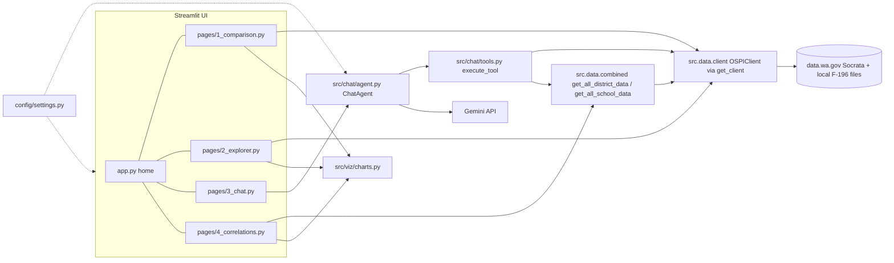

# Architecture overview

WA School Compare is a single-process **Streamlit** app (`app.py` is the entry; Streamlit's multipage convention picks up `pages/*.py`). It reads public Washington OSPI data from the data.wa.gov Socrata API plus local F-196 spending files, and renders it with Plotly. There is no database and no backend service of its own.

*Runtime dependency graph; `src/data/` is not documented here (see Scope below).*

## Layers and ownership

| Layer | Files | Responsibility |
|---|---|---|
| Entry / home | `app.py` | Page config, live homepage stats, background cache warming, dataset validation banner |
| Pages | `pages/1_comparison.py`, `2_explorer.py`, `3_chat.py`, `4_correlations.py` | One script per page; see [Streamlit pages](../workflows/streamlit-pages.md) and [Chat agent](../workflows/chat-agent.md) |
| Charts | `src/viz/charts.py` | Pure `create_*` functions returning Plotly figures from model dataclasses or DataFrames |
| Chat | `src/chat/` | Gemini function-calling agent, tool schemas/executor, system prompt |
| Config | `config/settings.py`, `config/datasets.yaml` | Env-driven settings, dataset IDs, query vocabulary: [Dataset vocabulary](../domain/dataset-vocabulary.md) |
| Data access | `src/data/{client,models,combined}.py` | `OSPIClient`, dataclasses, district/school batch frames. Excluded from this wiki by `.openwikiignore` (pattern `data/`) |
| Offline analysis | `analysis/`, `docs/` | Not imported at runtime: [Improvement benchmarks](../domain/improvement-benchmarks-analysis.md) |

## Runtime behaviors worth knowing

- **Home (`app.py`)**: `main()` sets `st.session_state.cache_warmed` once per session and starts a daemon thread calling `get_all_district_data()` and `get_all_school_data()` so the Correlations page is fast. `client.validate_datasets()` (cached 24 h) drives a sidebar warning listing unavailable datasets. `_get_homepage_stats()` is `@st.cache_data(ttl=86400)` and falls back to hard-coded 295 / 2400 / 1,100,000 on any exception. It calls the private `client._query` directly against `DATASET_IDS["enrollment"]` for 2024-25.
- **Caching**: `Settings.CACHE_TTL_SECONDS = 86400` (24 h). Data-layer failures are designed to degrade, not crash: `OSPIClient._query` returns `[]` on any API error (`tests/test_data_resilience.py`).
- **Session state is the cross-page bus**: Comparison stores `selected_entities` (list of `{id, name, type}`, max 5); Chat reads it; Explorer writes `type`/`id`/`year` to `st.query_params` for deep links and Chat reads them via `_build_page_context()`. See [Streamlit pages](../workflows/streamlit-pages.md).
- **Spending is district-only.** F-196 data has no school level; Comparison and Explorer fetch spending only when `org_level == "District"`, and the chat prompt and tool description both state the limit. Spending years use short form (`"23-24"`), derived by `school_year[2:]` from `"2023-24"`.
- **Suppression**: OSPI hides small cells (n<10). Models carry `is_suppressed`; UIs show `*` and `add_suppression_footnote()`.
- **Python 3.11+**, deps in `pyproject.toml` (streamlit, pandas, plotly, sodapy, google-genai, python-dotenv, pyyaml, openpyxl). `requirements.txt` exists for Streamlit Cloud; see [Deployment and CI](../operations/deployment-and-ci.md).

## Change navigation

- Consult this page when a change spans pages, caching, or the data/UI boundary.
- Adding a metric end-to-end touches `src/data/combined.py` (`METRICS`/`SCHOOL_METRICS`), the `analyze_correlation` enums in `src/chat/tools.py`, and possibly `pages/4_correlations.py` text. See [Chat agent](../workflows/chat-agent.md#extension-recipes).
- Adding a dataset or school-year: update `DATASET_IDS` and `config/datasets.yaml` together, then follow [Dataset vocabulary](../domain/dataset-vocabulary.md).
- Validate narrowly: `pytest tests/test_combined.py tests/test_data_resilience.py -q`. Full UI behavior has no automated test; smoke with `streamlit run app.py` only when page code changes.

## Scope boundary

`src/data/` matches the ignore rule `data/` and was not inspected. Its behavior is described here only as seen from callers and tests (method names such as `search_schools`, `get_assessment_data`, `get_spending_trend`, `get_spending_by_category`, `get_available_years`). Treat any deeper claim as unverified.
