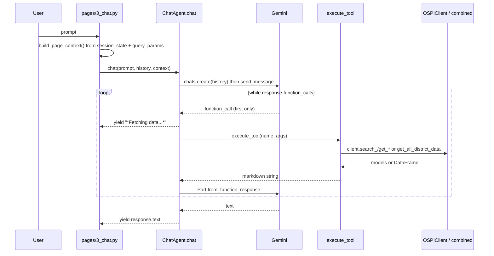

# Gemini chat agent and tool calling

The Chat page lets users ask questions in plain language. A `ChatAgent` (Google `google-genai` SDK) gives Gemini a set of function declarations; Gemini decides which data to fetch, `execute_tool` runs it against the same `OSPIClient` the other pages use, and the formatted text goes back to the model, which writes the final answer.

## Sequence

*One user turn; the page streams `yield`ed chunks into a placeholder with a cursor.*

## Components

- **`pages/3_chat.py`**: refuses to run (shows an error and info link) when `Settings.has_google_key` is false, otherwise keeps `messages` and a single `ChatAgent` in `st.session_state`. Rebuilds history excluding the current prompt, catches any exception and displays "Sorry, I encountered an error". "Clear Chat History" empties `messages`.
- **`_build_page_context()`**: emits `[SESSION CONTEXT] ... [END CONTEXT]` listing entities in `st.session_state.selected_entities` (from [Comparison](streamlit-pages.md)) and the Explorer's `type/id/year` query params. `ChatAgent.chat` appends it to `SYSTEM_PROMPT` for that turn by building a fresh `GenerateContentConfig`.
- **`ChatAgent`** (`src/chat/agent.py`): model, max tokens, temperature come from [`Settings`](../domain/dataset-vocabulary.md#settings-and-secrets). History roles are mapped to `user`/`model`. Because the loop only reads `response.function_calls[0]`, parallel calls in one turn are dropped; the loop has no iteration cap. `get_response` is the non-streaming wrapper (joins `chat`).
- **`SYSTEM_PROMPT`** (`src/chat/prompts.py`): states the seven capabilities, the district-only spending rule, 2014-15 to 2024-25 years, behavioral rules (search first, note suppression, cite year), and "cannot" list. `TOOL_DESCRIPTIONS` there duplicates the tool descriptions but is not referenced by the agent; the authoritative text is in `TOOL_SCHEMAS`.
- **Tools** (`src/chat/tools.py`): `TOOL_SCHEMAS` (generic `input_schema` form) are converted by `_convert_to_gemini_declaration` into `parameters_json_schema` and wrapped in `GEMINI_TOOLS` (one `types.Tool`). `execute_tool(tool_name, tool_input)` is an if/elif chain returning markdown strings, "No ... found" messages for empty results, and `Unknown tool: ...` otherwise.

| Tool | Client call | Key behavior |
|---|---|---|
| `search_schools`, `search_districts` | `client.search_*(query, limit=10)` | lists codes the model then passes on |
| `get_assessment_data` | `client.get_assessment_data` | defaults 2023-24, All Students, All Grades; normalizes grade via `grade_code`; flags suppressed rows |
| `get_demographics` | `get_demographics` | default 2024-25; Race/Ethnicity plus three program groups |
| `get_graduation_data` | `get_graduation_data` | only `All Students` rows |
| `get_staffing_data` | `get_staffing_data` | uses first result row |
| `get_spending_data` | `get_spending_data(district_code, "YY-YY")`, optional `get_spending_trend`, `get_spending_by_category` | district only; prints `20{year}` |
| `analyze_correlation` | `combined.get_all_district_data` | numpy corrcoef, polyfit R², strength wording, top 5, optional highlight; needs ≥3 districts with both metrics |

`analyze_correlation` imports `src.data.combined` and `numpy` lazily inside the branch. Its x/y enums list 19 metric keys matching `METRICS` in `src/data/combined.py`.

## Extension recipes

**Add a tool**: (1) append a schema to `TOOL_SCHEMAS`; (2) add an `elif tool_name == ...` branch in `execute_tool` returning a string; (3) mention it in `SYSTEM_PROMPT` capabilities and optionally `TOOL_DESCRIPTIONS`; (4) update `tests/test_tools.py` (`test_expected_tool_count`, `test_tool_names`, and a mocked-client result test using `mock_get_client`). `GEMINI_TOOLS` is built at import, so no extra registration exists. No bundled/generated mirror exists.

**Add or rename a correlation metric**: update both `x_metric` and `y_metric` enums in the schema together with `METRICS` in `src/data/combined.py` ([pages](streamlit-pages.md#change-navigation)).

**Change model/temperature**: edit `Settings` only; `ChatAgent.__init__` reads them once per session.

**Change vocabulary** (grades, groups): keep schema descriptions in sync with [Dataset vocabulary](../domain/dataset-vocabulary.md); the schema's `grade_level` enum is literal codes.

Non-goals: provider switching (Anthropic/OpenAI keys are reserved but unused), school-level spending. Escalate to the data-layer owner if a tool needs a new `OSPIClient` method (`src/data/`, not covered here).

## Validation

`pytest tests/test_tools.py -q` covers schema shape, Gemini conversion (enum preserved), and each tool's formatting with a mocked client (no results, results, suppressed, trend). The agent loop and the page have no tests; calling Gemini needs a real `GOOGLE_API_KEY` and is a conditional manual check only when `agent.py` changes.
ini needs a real `GOOGLE_API_KEY` and is a conditional manual check only when `agent.py` changes.
and is a conditional manual check only when `agent.py` changes.
