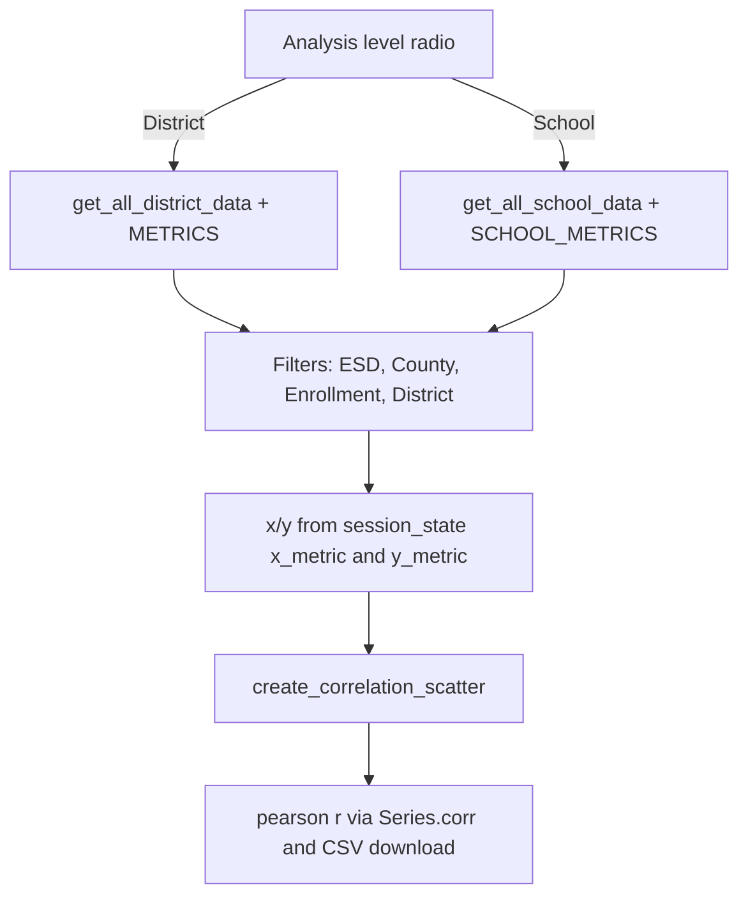

# Streamlit pages and chart helpers

All pages obtain data through `get_client()` (an `OSPIClient`, in the excluded `src/data/`) and render with `src/viz/charts.py`. Pages are plain scripts with `st.set_page_config` and a `main()` (Correlations runs at module level). There are no automated UI tests; see [Testing](../testing/testing.md). Architecture context: [overview](../architecture/overview.md).

## Comparison (`pages/1_comparison.py`)

- Sidebar: choose Districts or Schools, search (≥2 chars, `search_districts`/`search_schools` limit 20), add to `st.session_state.selected_entities` as `{"id","name","type"}`. Hard cap 5, duplicates rejected.
- Main: school year (`client.get_available_years()`), student group (core, or core+extended via "Show all subgroups"), and grade level; options come from [`Settings`](../domain/dataset-vocabulary.md).
- Loading: inside one `st.status` block it loops entities and calls `get_assessment_data`, `get_demographics`, `get_graduation_data`, `get_staffing_data`; for districts only, `get_spending_data(org_id, school_year[2:])`, `get_spending_trend`, `get_enrollment_trend`, `get_spending_by_category`.
- Seven tabs: Achievement (with a Subgroup Analysis expander that calls assessment once per `STUDENT_GROUPS_CORE` and needs ≥2 non-suppressed groups), Score Distribution, Demographics, Graduation (Four/Five Year radio), Staffing (chart + CSV), Spending (district-only notice for schools), Trends (last 5 `available_years`, requires ≥2).
- Data is keyed by display name in dicts, so two entities with the same display name would collide.

## Explorer (`pages/2_explorer.py`)

- Deep link contract: reads `type`, `id`, `year` from `st.query_params`; when no search is active and `id` is set it loads via `get_district_by_code` / `get_school_by_code`. After selection it writes `type`, `id`, `year` back. The [chat page](chat-agent.md) reads these same params to build its session context, so renaming them breaks that link.
- Sections: overview metric cards (ELA/Math filtered to selected grade, four-year graduation for All Students, first staffing row), Achievement table with CSV, score distribution, and opt-in toggles (subgroup analysis with equity-gap tab, grade-level breakdown over `GRADE_LEVELS[1:]` x 3 subjects, assessment trend, graduation trend), Demographics, Graduation, Staffing, and district-only Spending with 10-year spending/enrollment trends and category breakdown.
- Toggles are lazy because each performs many API calls.

## Correlations (`pages/4_correlations.py`)

*Data flow of the Correlations page.*

- Metric dictionaries `METRICS` (19 entries per `tests/test_combined.py`) and `SCHOOL_METRICS` (10; excludes spending and graduation) live in `src/data/combined.py` with `label`/`category`/`format` keys. Dropdown order follows a fixed category list: Spending, Achievement, Graduation, Demographics, Staffing, Size. A metric whose category is not in that list is silently omitted from the dropdowns.
- Defaults: district `per_pupil_expenditure` vs `ela_proficiency`; school `pct_low_income` vs `ela_proficiency`.
- `SUGGESTED_ANALYSES` buttons write the metric keys into session state and `st.rerun()`; a button renders only if both metrics exist at the current level.
- Highlighting: districts multi-select (max 10); in school view, highlight all schools of a chosen district.
- Stale text: the radio help says District has "12 metrics"; the code has 19.
- The page passes `entity_name_col`/`entity_code_col` so one chart function serves both levels.

## Home (`app.py`)

Static intro, three live metrics, cache warming and dataset validation; details in the [overview](../architecture/overview.md). The intro lists only three pages and omits Correlations (README lists five).

## Chart helpers (`src/viz/charts.py`)

Stateless `create_*` functions return `go.Figure`: `create_achievement_comparison`, `create_score_distribution`, `create_demographics_chart`, `create_program_demographics_chart`, `create_trend_chart`, `create_graduation_chart`, `create_staffing_chart`, `create_spending_chart`, `create_spending_trend_chart`, `create_equity_gap_chart`, `create_spending_breakdown_chart`, `create_enrollment_trend_chart`, `create_subgroup_proficiency_chart`, `create_grade_breakdown_chart`, `create_correlation_scatter`, `create_multi_entity_trend_chart`, and `add_suppression_footnote`. Shared `COLORS` and `ENTITY_COLORS` (Set2) keep styling consistent; performance levels 1-4 map red/orange/green/blue. `create_correlation_scatter` returns an empty-state chart (`_empty_chart`) when required columns are missing or no rows have both metrics, and overlays a regression line (R²) per the page text.

## Change navigation

- New chart: add `create_*` to `charts.py` taking dataclasses/DataFrames (types from `src.data.models`), import it from `src.viz.charts` in the page (add it to `src/viz/__init__.py` only if the package-level import is needed), render with `st.plotly_chart(fig, width="stretch")`. There are no chart tests; verify by running the app page with `streamlit run app.py`.
- New metric on Correlations: add to `METRICS` (and `SCHOOL_METRICS` if school-level) in `src/data/combined.py`; run `pytest tests/test_combined.py` (it asserts exact counts 19 and 10, so update them), and update the `analyze_correlation` enums in [chat tools](chat-agent.md#extension-recipes).
- New per-entity data on Comparison/Explorer: add the client call inside the loading `st.status` block; keep spending district-only.
- Avoid putting heavy per-group loops outside toggles/expanders.
lation` enums in [chat tools](chat-agent.md#extension-recipes).
- New per-entity data on Comparison/Explorer: add the client call inside the loading `st.status` block; keep spending district-only.
- Avoid putting heavy per-group loops outside toggles/expanders.
